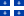
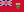
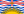
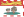
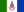
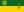

# Discover Canada 🍁

> [!TIP]
> Use the numbers from the official study guide, regardless of any newer or updated information.

## Rights and Responsibilities of Citizenship ⚖️

- `1215` **Magna Carta** in England (Great Charter of Freedoms)
  - Freedom of conscience and religion
  - Freedom of thought, belief, opinion and expression, including freedom of speech and of the press
  - Freedom of peaceful assembly
  - Freedom of association
- **Habeas corpus**, the right to challenge unlawful detention by the state, from English common law
- `1982` Canadian Charter of Rights and Freedoms
  - Mobility Rights
  - Aboriginal Peoples' Rights
  - Official Language Rights and Minority Language Educational Rights
  - Multiculturalism
- Equality of Women and Men
- Citizenship Responsibilities
  1. Obeying the law (the rule of law)
  2. Taking responsibility for oneself and one's family
  3. Serving on a jury
  4. Voting in elections
  5. Helping others in the community
  6. Protecting and enjoying our heritage and environment
- Defending Canada
- Oath, Canada is personified by the Sovereign

## Who We Are 👨‍👩‍👧‍👦

- Aboriginal Peoples
  1. First Nations (Indian), 65%
  2. Métis, 30%
  3. Inuit, 4%
- English and French
  - 18 million Anglophones, and 7 million Francophones
  - English, Welsh, Scottish, Irish settlers
  - Acadians, the descendants of French settlers in the Maritime provinces
  - Quebecers. In `2006`, the House of Commons recognized that Quebecois form a nation within a united Canada

## Canada's History 📜

- The Vikings from Iceland colonized Greenland `1000` years ago, also reached Labrador and the island of Newfoundland
- `1497` John Cabot, was the first to draw a map of Canada's East Coast
- `1534-1542` Jacques Cartier made 3 voyages across the Atlantic
- Royal New France: Samuel de Champlain founded Quebec City in `1608`
- `1670` Hudson's Bay Company established, competing with Montreal-based traders
- `1759`, the British defeated the French, marking the end of France's empire in America
- Quebec Act of `1774` restored French civil law while maintaining British criminal law
- More than `40,000` United Empire Loyalists fled to Canada during and after the American Revolution
- The first representative assembly was elected in Nova Scotia `1758`, PEI `1773`, New Brunswick `1785`
- The Constitutional Act of `1791` divided the Province of Quebec into Upper Canada (Ontario, mainly Loyalist, Protestant and English-speaking) and Lower Canada (Quebec, heavily Catholic and French-speaking)
- `1783` Upper Canada, led by Lieutenant Governor John Graves Simcoe, abolished slavery
- The War of `1812`: The Fight for Canada. The American attempt to conquer Canada had failed.
- Rebellions of `1837–38`, the rebels did not have enough public support to succeed
- In `1848–49` the governor of United Canada, Lord Elgin, with encouragement from London, introduced **responsible government** (if the government loses a confidence vote in the assembly it must resign)
- `1867` The British North America Act (now known as the Constitution Act, 1867), the Dominion of Canada was born on `July 1`. Sir John Alexander Macdonald, a Father of Confederation, became Canada's first Prime Minister
- Métis resistance led by Louis Riel, the father of Manitoba, in response to land policies. North West Mounted Policy was established in `1873`
- Expansion of the Dominion
  - `1867`  Ontario,  Quebec,  Nova Scotia,  New Brunswick
  - `1870`  Manitoba,  Northwest Territories
  - `1871`  British Columbia
  - `1873`  Prince Edward Island
  - `1880` Transfer of the Arctic Island to N.W.T.
  - `1898`  Yukon Territory
  - `1905`  Alberta,  Saskatchewan
  - `1949`  Newfoundland and Labrador
  - `1999`  Nunavut
- `1885` Completion of the Canadian Pacific Railway
- More than `600,000` Canadians served during World War I, `60,000` were killed and `170,000` wounded
- More than `1,000,000` Canadians served during World War II, `44,000` were killed

## Modern Canada 📰

- The Official Languages Act (`1969`)
- Discoveries and Inventions
  - 🏀 Basketball - James Naismith
  - ☎️ Telephone - Alexander Graham Bell
  - 🛷 Snowmobile - Joseph-Armand Bombardier
  - 🕑 Time zones - Sir Sandford Fleming
  - 💡 Lightbulb - Mathew Evans and Henry Woodward
  - 📻 Wireless voice message - Reginald Fessenden
  - 💓 Pacemaker - John Hopps
  - 🦾 Canadarm - SPAR Aerospace/National Research Council
  - 📱 Blackberry - Mike Lazaridis and Jim Balsillie

## How Canadians Govern Themselves 🏛️

### Levels of Government

- Federal State
  - Defence, foreign policy, interprovincial trade and communication, currency, navigation, criminal law and citizenship
- Provincial
  - Municipal government, education, health, natural resources, property and civil rights, highways
- Shared Jurisdictions
  - Agriculture, immigration
- Local or municipal
  - Council passes by-laws
  - Urban or regional planning, streets and roads, sanitation, snow removal, firefighting, ambulance and other emergency services, recreational facilities, public transit and some local health and social services. Major urban centres have municipal police forces

### Parliamentary Democracy

- Parliament has `3` parts:
  - 1️⃣ **Sovereign** 👑
  - 2️⃣ **Senate**, appointed by the Governor General on the advice of the Prime Minister
  - 3️⃣ **House of Commons**, elected by the people every `4` years
- [Prime Minister](## "Mark Carney is the current Prime Minister of Canada") selects the Cabinet ministers
- Cabinet ministers are responsible to the elected representatives
- No bill (proposals for new laws) can become law until passed by both chambers

### Constitutional Monarchy

  - Head of **State** - the [Sovereign](## "King Charles III is the current Head of State")
    - Represented by the [Governor General of Canada](## "Mary Simon is the current Governor General of Canada"), the [Lieutenant Governor](## "Edith Dumont is the current Lieutenant Governor of Ontario") (10 provinces), for `5` years
  - Head of **Government** - the Prime Minister
    - [Premier](## "Doug Ford is the current Ontario premier") (each province)
    - Commissioner (3 territories)
  - Three branches of government - Executive, Legislative, and Judicial

## Federal Elections ✅

- [`308`](## "Currently 343") electoral districts (aka ridings or constituencies)
- **Secret ballot**, no one can watch you vote and no one should look at how you voted

## The Justice System 👩‍⚖️

- Presumption of innocence
- Rule of law, freedom under the law, democratic principals and due process
- The Supreme Court of Canada is the highest court

## Canadian Symbols 🦫

- 🇨🇦 New Canadian flag `1965`
- ⚜️ Fleur-de-lis
- 🎖️ The Order of Canada recognizes outstanding citizens
- ✝️ The Victoria Cross, the highest honour to Canadians

## Canada's Economy 💰

- `1994` [North American Free Trade Agreement (NAFTA)](## "Replaced by CUSMA in 2020")
- 75% Service industries

## Canada's Regions 🗺️

- Regions - Provinces and Territories (Capitals)
    - Atlantic Provinces
        -  Newfoundland and Labrador (St. John's), own time zone
        -  Prince Edward Island (Charlottetown)
        -  Nova Scotia (Halifax)
        -  New Brunswick (Fredericton), bilingual province
    - Central Canada
        -  Quebec (Quebec City)
        -  Ontario (Toronto)
    - Prairie Provinces
        -  Manitoba (Winnipeg)
        -  Saskatchewan (Regina)
        -  Alberta (Edmonton)
    - West Coast
        -  British Columbia (Victoria)
    - North
        -  Yukon (Whitehorse)
        -  Northwest Territories (Yellowknife)
        -  Nunavut (Iqaluit)
- Ottawa, capital since `1857`
- Population: 34 million

## Useful Links 🔗

https://www.canada.ca/content/dam/ircc/migration/ircc/english/pdf/pub/discover.pdf
https://canoo.ca/canadian-citizenship-practice-test/